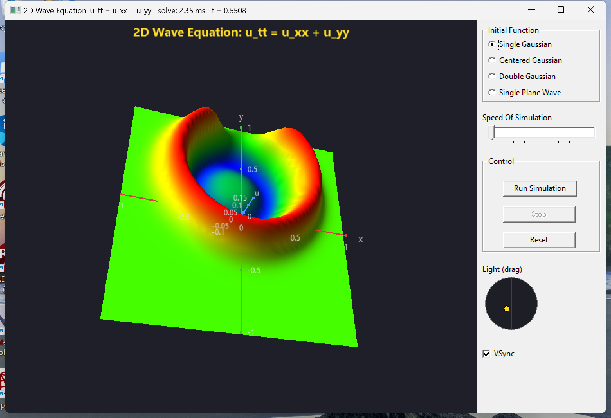

# newVM

`newVM` is a Free Pascal / Lazarus library providing matrix/vector objects
that wrap Intel MKL (BLAS/LAPACK/VSL), Intel IPP, OpenBLAS, FFTW, and
(where available) GPU acceleration via OpenCL/clFFT and Metal. It is
explicitly inspired by the Dew MtxVec library for Delphi.

## Why this exists

This library was developed largely so that I could migrate my own
software off Delphi/MtxVec and onto Free Pascal, while keeping access to
hardware-accelerated linear algebra where a given machine has it
available. Unlike MtxVec, `newVM` does not distinguish matrix and vector
types — a vector is just an (N,1) or (1,N) matrix — and it ships in four
parallel real/complex × double/single "flavours" plus an integer
companion type for index work. See `CLAUDE.md` for the full architecture
writeup.

## Platform support

`newVM` is developed to be multi-platform, and has so far been built and
verified on:

- Windows 11
- Kubuntu
- macOS
- Raspberry Pi

All of the demo applications run on all four platforms. The one
exception is **SDR_Radio** — a small software-defined-radio test
application built on top of `newVMCL` (the OpenCL-backed matrix type),
put together with Claude's help as a way to exercise GPU-accelerated FFT
and real-time DSP through the library rather than as a polished product
in its own right. It works on all four platforms, but is inherently
limited by the SDR hardware and available compute, particularly on
Raspberry Pi.

## Acceleration libraries — you need to configure your own machine

None of MKL, IPP, OpenBLAS, FFTW, OpenCL/clFFT, or Metal are vendored or
auto-installed by this repository. Each machine needs the relevant
libraries installed and discoverable (on `PATH`, or via the platform's
normal dynamic-linker search) before building:

| Platform | Expected acceleration libraries |
|---|---|
| Windows | BLAS (MKL/OpenBLAS), LAPACKE (MKL), FFTW, OpenCL + clFFT |
| Linux (Kubuntu, etc.) | BLAS (MKL/OpenBLAS), LAPACKE (MKL), FFTW, OpenCL + clFFT |
| macOS | FFTW, Metal (+ MetalPerformanceShadersGraph) |
| Raspberry Pi | FFTW, Arm Performance Libraries (ArmPL) |

Run `newvmconfigure` (see `CLAUDE.md`'s "Build" section) after installing
libraries on a given machine — it probes what's actually present and
regenerates `newVMConfig.inc` accordingly. Any backend that isn't found
falls back to a pure-Pascal implementation automatically (`PUREPASCAL`),
so the library still builds and runs correctly without any of these
installed — just slower.

## Acknowledgements

This library's fallback code and a good deal of its implementation work
were built with the assistance of **Claude** (Anthropic). The pure-Pascal
eigenvalue decomposition fallback (`PurePascalEigHqr2`/`S`) is ported from
the EISPACK-derived Balance/Elmhes/Eltran/Hqr2/Balbak routines in
**LMath**, a third-party Pascal numerical library vendored under
`LMath/` for reference. See `CLAUDE.md` for the specifics of what came
from where.

## Contributing

Other developers are welcome to use and extend this code.

## Screenshot

`Wave2D_FPC` (under `demos/Chebyshev/`), a Chebyshev-spectral solver for
the 2D wave equation `u_tt = u_xx + u_yy`, rendered live via the
`TVMPlot3D` component:

